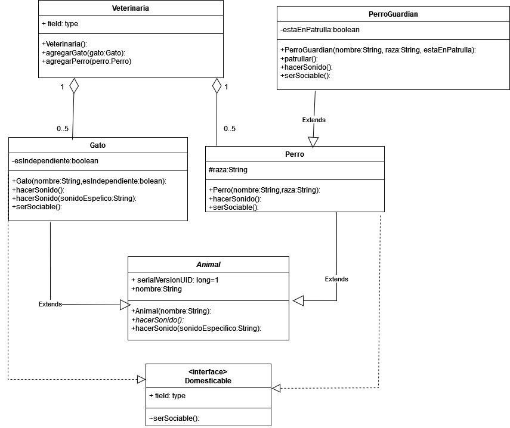

# Tarea2 (Diagrama de clases) #
El propósito de esta tarea es revisar la comprensión sobre los temas de los diagramas 
de clase así como sus distintos tipos de asociaciones.

## UML (Unified Modeling Language) ##
UML es un lenguaje de modelado estandarizado que se utiliza para visualizar, especificar, construir y documentar los componentes de un sistema de software. Proporciona una forma estandarizada de representar el diseño de un sistema mediante diferentes tipos de diagramas, ayudando a los desarrolladores a comprender y comunicar la estructura y el comportamiento del sistema.

El diagrama que se realizó fue el de clases.

### Diagrama de clases ###
Es uno de los tipos más comunes de diagramas en UML. Representa la estructura estática de un sistema mostrando sus clases, atributos, métodos y las relaciones entre los objetos.

### Componentes para realizar un diagrama de clases ###
- **Clases**: Representadas por rectángulos que contienen el nombre de la clase, atributos y métodos.
- **Atributos**: Propiedades o datos de la clase.
- **Métodos**: Funciones o comportamientos de la clase.
- **Relaciones**: Las conexiones entre clases, que incluyen asociaciones, agregaciones, composiciones y dependencias.

### Tipos de relaciones ###

#### Extensión (extends) ####
En UML, la herencia o generalización se representa con una línea continua con un triángulo vacío apuntando hacia la clase base. Indica que una clase (subclase) hereda atributos y métodos de otra clase (superclase).

#### Interfaz (interface) ####
Una interfaz en UML es similar a una clase abstracta, pero todos sus métodos son abstractos (sin implementación). Se representa con el estereotipo `<<interface>>` y se conecta a las clases que la implementan mediante una línea con un triángulo vacío.

#### Cardinalidad ####
La cardinalidad define el número de instancias que pueden estar involucradas en una relación. Se representa mediante notaciones como `1`, `0..1`, `*` (muchos), `0..*`, `1..*`, etc., y se coloca junto a los extremos de las asociaciones.

### Diagrama de Clase ###

